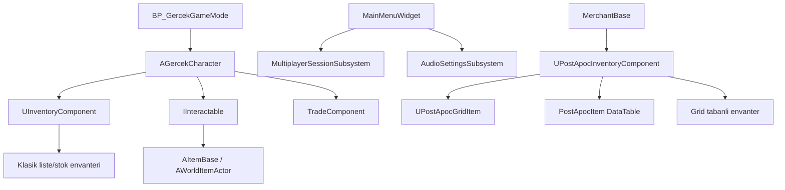

# Gercek Project Status

Bu dosya, projenin 20 Mart 2026 tarihli mevcut teknik durumunu referans almak icin hazirlandi.
Amac, bundan sonraki oyun gelistirmelerinde ortak bir "neredeyiz / sonra ne yapacagiz" zemini saglamaktir.

## 1. Mimari Sema

## 2. Sistem Durumu

### Tamamlanan veya kullanilabilir durumda olan sistemler

- Karakter hareketi, stamina, hunger, thirst ve interaction akisi mevcut.
  Referans: [GercekCharacter.h](C:\GercekProje\Gercek\Source\Gercek\GercekCharacter.h), [GercekCharacter.cpp](C:\GercekProje\Gercek\Source\Gercek\GercekCharacter.cpp)
- Dunyadaki item'i alip klasik envantere ekleme akisi mevcut.
  Referans: [ItemBase.cpp](C:\GercekProje\Gercek\Source\Gercek\ItemBase.cpp), [WorldItemActor.cpp](C:\GercekProje\Gercek\Source\Gercek\WorldItemActor.cpp)
- Klasik agirlik bazli envanter ve agirlik degisim event'i mevcut.
  Referans: [InventoryComponent.h](C:\GercekProje\Gercek\Source\Gercek\InventoryComponent.h), [InventoryComponent.cpp](C:\GercekProje\Gercek\Source\Gercek\InventoryComponent.cpp)
- Temel alis/satis ve para mantigi mevcut.
  Referans: [TradeComponent.h](C:\GercekProje\Gercek\Source\Gercek\TradeComponent.h), [TradeComponent.cpp](C:\GercekProje\Gercek\Source\Gercek\TradeComponent.cpp)
- Ana menu sayfa gecisleri, video ayarlari ve buton baglamalari mevcut.
  Referans: [MainMenuWidget.cpp](C:\GercekProje\Gercek\Source\Gercek\MainMenuWidget.cpp)
- Ses ayarlari save/load sistemi ve engine override akisi mevcut.
  Referans: [AudioSettingsSubsystem.cpp](C:\GercekProje\Gercek\Source\Gercek\AudioSettingsSubsystem.cpp:44), [AudioSettingsSubsystem.cpp](C:\GercekProje\Gercek\Source\Gercek\AudioSettingsSubsystem.cpp:116)
- Steam session tabanli host, ara, katil akisi mevcut.
  Referans: [MultiplayerSessionSubsystem.cpp](C:\GercekProje\Gercek\Source\Gercek\MultiplayerSessionSubsystem.cpp:53), [MultiplayerSessionSubsystem.cpp](C:\GercekProje\Gercek\Source\Gercek\MultiplayerSessionSubsystem.cpp:104), [MultiplayerSessionSubsystem.cpp](C:\GercekProje\Gercek\Source\Gercek\MultiplayerSessionSubsystem.cpp:147)
- Grid tabanli yeni envanterin temel veri modeli ve UI refresh mantigi mevcut.
  Referans: [PostApocInventoryTypes.cpp](C:\GercekProje\Gercek\Source\Gercek\PostApocInventoryTypes.cpp:105), [PostApocInventoryTypes.cpp](C:\GercekProje\Gercek\Source\Gercek\PostApocInventoryTypes.cpp:284)
- Tuccar karakteri kendi grid envanterini baslangicta doldurabiliyor.
  Referans: [MerchantBase.cpp](C:\GercekProje\Gercek\Source\Gercek\MerchantBase.cpp)

### Yari veya riskli durumda olan sistemler

- Projede iki envanter mimarisi ayni anda yasiyor.
  Klasik akista `UInventoryComponent`, yeni akista `UPostApocInventoryComponent` kullaniliyor. Bu iki sistem henuz tek bir oyuncu akisinda birlestirilmis degil.
- Ana menu ses slider'lari su an sadece progress bar guncelliyor.
  `MainMenuWidget` icindeki `OnMasterVolumeChanged`, `OnSFXVolumeChanged`, `OnMusicVolumeChanged` fonksiyonlari `AudioSettingsSubsystem` cagrisi yapmiyor.
  Referans: [MainMenuWidget.cpp](C:\GercekProje\Gercek\Source\Gercek\MainMenuWidget.cpp:273)
- Session host akisi hala `FirstPerson` haritasina travel ediyor.
  Varsayilan map `Istanbul`, ama host olunca `ServerTravel("/Game/FirstPerson/Lvl_FirstPerson?listen")` cagriliyor.
  Referans: [DefaultEngine.ini](C:\GercekProje\Gercek\Config\DefaultEngine.ini:69), [MultiplayerSessionSubsystem.cpp](C:\GercekProje\Gercek\Source\Gercek\MultiplayerSessionSubsystem.cpp:77)
- Grid envanter item kimligi satir adi bazli tutuluyor.
  `OccupiedSlotsArray` icinde sadece `ItemID(RowName)` saklandigi icin ayni itemden birden fazla bagimsiz kopya oldugunda instance bazli ayristirma zayif.
  Referans: [PostApocInventoryTypes.h](C:\GercekProje\Gercek\Source\Gercek\PostApocInventoryTypes.h), [PostApocInventoryTypes.cpp](C:\GercekProje\Gercek\Source\Gercek\PostApocInventoryTypes.cpp:153)
- `GetInventoryValue()` ayni `RowName` icin tek sefer sayim yapiyor.
  Bu, ayni itemden iki ayri adet varsa toplam degerin eksik hesaplanmasi riskini dogurur.
  Referans: [PostApocInventoryTypes.cpp](C:\GercekProje\Gercek\Source\Gercek\PostApocInventoryTypes.cpp:261)
- `HandleItemDrop()` kismi olarak koordinatli drop yapiyor, ama fallback yine `TryAddItem()` ile "ilk uygun yere" yerlestirme mantigina donuyor.
  Bu yuzden surukle-birak davranisi deterministik degil.
  Referans: [PostApocInventoryTypes.cpp](C:\GercekProje\Gercek\Source\Gercek\PostApocInventoryTypes.cpp:370)
- Replikasyon bildirimi icin `OnRep_GridUpdated()` var, ancak sunucu tarafli mutasyonlardan sonra UI refresh zincirinin tum ekranlarda eksiksiz baglandigi bu kodlardan tek basina garanti edilmiyor.
  Referans: [PostApocInventoryTypes.cpp](C:\GercekProje\Gercek\Source\Gercek\PostApocInventoryTypes.cpp:421)

### Henuz eksik veya netlestirilmemis alanlar

- Oyuncunun aktif kullandigi envanter UI'nin hangisi olacagi:
  klasik slot bazli ekran mi, yoksa grid/tetris envanter mi?
- Grid envanter ile dunya item pickup akisinin oyuncuya entegre edilmesi.
- Tuccar UI, barter ekran akisi ve oyuncu-grid ile tuccar-grid arasindaki somut takas ekranlari.
- Co-op oyun akisinda envanter, item pickup ve trader davranisinin yetki/replication kurallari.
- Save/load kapsaminda sadece ses degil, oyuncu envanteri ve oyun ilerlemesinin kaliciligi.

## 3. Onerilen Gelistirme Sirasi

Bu sira, sistemi dallandirip karmasiklastirmadan once tek bir oynanis omurgasi olusturmak icin secildi.

1. Envanter dogrultusunu netlestir ve tek sisteme in.
   Oneri: Oyuncu tarafinda hedef sistem `UPostApocInventoryComponent` olsun. Klasik `UInventoryComponent` ya kaldirilir ya da yalnizca gecici uyumluluk katmani olarak tutulur.

2. Oyuncu pickup akisini grid envantere bagla.
   `AItemBase` ve `AWorldItemActor` tarafindaki pickup mantigi oyuncunun kullandigi nihai envanter sistemine yazilmali.

3. Grid envanter icin oyuncu UI'sini tamamla.
   Sabit widget iskeleti, surukle-birak, rotate, tooltip, item value ve condition gosterimi bu asamada tamamlanmali.

4. Tuccar ekranini oyuncu envanteriyle bagla.
   `MerchantBase` envanteri sadece veri tutmakla kalmamali; oyuncu tarafinda alim-satim veya barter ekranina baglanmali.

5. Ekonomi ve item instance modelini duzelt.
   Ayni itemin birden fazla kopyasini saglikli tasimak icin `RowName` disinda instance bazli kimlik, quantity ve condition modeli eklenmeli.

6. Multiplayer harita ve gameplay akisini birlestir.
   Session kuruldugunda gidilen harita, mevcut varsayilan oyun akisiyla ayni haritaya alinmali. Sonra pickup, envanter ve trader aksiyonlari icin server-authoritative kurallar netlestirilmeli.

7. Ses ve menu entegrasyonunu kapat.
   `MainMenuWidget` slider'lari dogrudan `AudioSettingsSubsystem` ile konusmali ve mevcut save sistemi fiilen kullanilmali.

8. Save/load kapsamini genislet.
   Ses ayarlari disindaki oyun verileri icin de kalici bir save stratejisi tasarlanmalı.

## 4. Kisa Teknik Sonuc

Projenin cekirdegi saglamlasiyor, ancak su an en buyuk teknik karar noktasi envanter mimarisi.
Grid sistemine gecilecekse bundan sonraki UI, trader ve multiplayer isleri o eksene oturtulmali.
En fazla kaldirac etkisi yaratacak sonraki adim, oyuncu envanterini tek bir grid akisina birlestirmek olacaktır.
