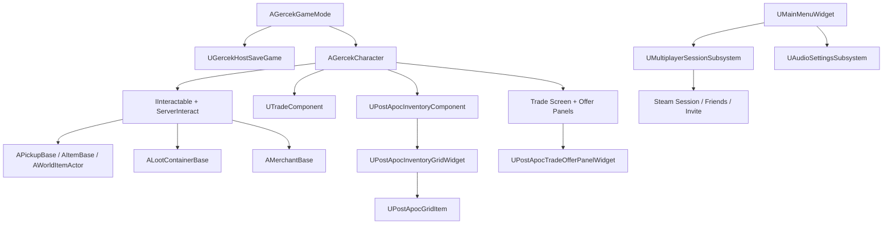

# Gercek Project Status

Bu dosya, 21 Mart 2026 itibariyla projenin guncel teknik durumunu ozetler.
Bugunku guncelleme ile birlikte proje artik host-authoritative save/load, instance-id tabanli grid envanter, condition/value ekonomisi, yarim dolu/tam dolu yiyecek ekonomisi, server-guvenli etkileşim ve Steam co-op session omurgasina sahiptir.

## 1. Guncel Mimari

## 2. Temel Sistemler

### Karakter ve oynanis omurgasi
- Ana karakter sinifi `AGercekCharacter`.
- Survival ozellikleri: `Health`, `Hunger`, `Thirst`, `Stamina`, `Radiation`.
- Trade progression: `TradeXP`, `CurrentKnowledge`.
- Local-only interaction trace timer ve server re-check ile guvenli etkileşim.
- Inventory, loot container ve trade UI acma/kapama akislari karakter ustunden yonetiliyor.

### Etkilesim sistemi
- Tick tabanli degil, `0.1s` timer tabanli local trace kullaniyor.
- Proje-ozel `Interactable` trace kanali aktif.
- Gercek eylem `ServerInteract()` ve server-side line trace ile dogrulaniyor.
- `IInteractable` arayuzu sayesinde karakter hedef aktoru cast etmiyor.

### Grid envanter sistemi
- Ana oyuncu envanteri `UPostApocInventoryComponent`.
- Her item artik `FGuid ItemInstanceId` ile tekil kimlige sahip.
- Grid slot verisi: `Location`, `ItemInstanceId`, `ItemRowName`, `bIsRotated`, `Condition`.
- UI item renderi benzersiz instance listesi ustunden yapiliyor.
- Drag-drop, use, drop, loot transfer ve trade secimi instance-id ile calisiyor.
- Eski row-name tabanli API'ler yalnizca uyumluluk katmani olarak tutuluyor.

### Kondisyon ve ekonomi sistemi
- Her item instance `10-100` kondisyon tutuyor.
- `>=100` baz degerli itemlar icin condition breakpoints:
  - `85-100`: kayip yok
  - `70-84`: `%15` kayip
  - `49-69`: `%28` kayip
  - `25-48`: `%48` kayip
  - `10-24`: `%80` kayip
- `99 ve alti` baz degerli itemlar icin:
  - `70-100`: kayip yok
  - `10-69`: `%30` kayip
- Tum yuvarlama `RoundToInt` ile yapiliyor.

### TradeKnowledge sistemi
- `TradeXP` sadece serverda artiyor.
- Tier progression:
  - `0-1999`: `Novice`
  - `2000-4999`: `Apprentice`
  - `5000+`: `Expert`
- UI bilgi katmani:
  - `Novice`: `???`
  - `Apprentice`: yaklasik aralik (`~ min-max`)
  - `Expert`: net deger
- Mekanik katman:
  - Tuccardan alinan mallarda `Apprentice` `%5`, `Expert` `%10` gercek alim avantaji sagliyor.
  - Bu indirim server-side trade validation'a dahil.

### Trade sistemi
- Trade teklifleri artik `FGuid` tabanli item instance listeleriyle tutuluyor.
- Offer panelleri C++ tarafinda karakter state'inden dolduruluyor.
- Trade screen acildiginda oyuncu ve tuccar teklif listeleri sifirlaniyor.
- Grid item click/double-click ve drag-drop ile offer listelerine ekleme/cikarma yapilabiliyor.
- Server-side trade validation:
  - mesafe kontrolu
  - stale selection kontrolu
  - value validation
  - rollback ile kismi veri kaybi onleme
- Trade sonucu client RPC ile bildiriliyor.

### Loot container sistemi
- `ALootContainerBase` kendi `UPostApocInventoryComponent` envanterini tasiyor.
- Item alma/birakma server authority ile gerceklesiyor.
- Item transferlerinde instance id ve condition korunuyor.
- Shared access veya tek oyuncu kullanim kurallari var.

### Pickup sistemi
- `APickupBase`, `AItemBase`, `AWorldItemActor` dunyadaki alinabilir item omurgalari.
- Pickup sonrasinda item serverda oyuncu envanterine condition bilgisiyle yaziliyor.
- Drop sonrasinda item condition kaybetmeden dunya aktorune donusuyor.

### Save / Load / Reconnect
- Host-authoritative save omurgasi aktif.
- Oyuncu verileri host bilgisayarindaki tek save dosyasina yaziliyor.
- `SteamId` bazli oyuncu restore yapiliyor.
- `Logout` ve autosave akisi mevcut.
- Reconnect, duplicate join ve retry restore senaryolari sertlestirildi.
- Save version `4`:
  - instance-id
  - rotation
  - condition
  - fill state
  - merchant inventory
  - chest/container inventory
  - persistent dropped item state
  verilerini sakliyor.
- Legacy save'ler migrasyonla yuklenebiliyor.

### Dunya persistence
- `AGercekGameMode` artik merchant, chest/container ve runtime dropped item state'ini snapshot/restore ediyor.
- `AMerchantBase` ve `ALootContainerBase` `PersistentId` bazli restore aliyor.
- `AWorldItemActor` sadece `persistent world drop` olarak isaretliyse save'e giriyor; map'e editor'den konmus normal dunya loot'u gereksiz yere save dosyasina kopyalanmiyor.
- Autosave disk yazimi async calisiyor ve save in-flight iken gelen yeni save istegi queue'ya alinip tek follow-up save olarak isleniyor.

### Steam co-op / session sistemi
- `UMultiplayerSessionSubsystem` create/find/join/continue akislarini yonetiyor.
- Session metadata:
  - visibility
  - password protected/hash
  - session id
  - save slot
  - host identity
  - continue flag
  - map path
- Host create sonrasi `Istanbul` haritasina `?listen` ile travel ediyor.
- Friends list ve invite overlay omurgasi aktif.

### Main menu sistemi
- Yeni `WBP_MainMenu` buton akisi C++ ile bagli.
- `WidgetSwitcher` tabanli sayfa yonetimi var.
- `Continue`, `Create`, `Join`, `InviteFriends`, `Exit` akislari C++ tarafinda calisiyor.
- `NativeDestruct` icinde session delegate temizligi yapiliyor.

## 3. Tamamlanan Buyuk Refactorlar

1. Server-guvenli etkileşim mimarisi.
2. Host-authoritative save/load ve reconnect.
3. Pickup ve loot container base class omurgalari.
4. Instance-id tabanli grid item kimligi.
5. Condition + economy sistemi.
6. TradeKnowledge'un UI + mekanik trade katmanina entegrasyonu.
7. Trade offer panellerinin C++ instance-id state'e tasinmasi.

## 4. Kalan Bilincli Riskler / Sonraki Adimlar

- `AudioSettingsSubsystem` entegrasyonu menu redesign sonrasina birakildi.
- Grid UI tooltip/label gorunurlugu, `WBP_InventoryGridItem` icinde `Txt_ItemName`, `Txt_ItemCondition`, `Txt_ItemValue` alanlari varsa zenginlesir; yoksa tooltip metni yine calisir.
- Trade offer panelleri runtime'da `Txt_OyuncuTeklif` ve `Txt_TuccarIstek` anchor'larina gore yerlestiriliyor. Trade BP layout'u buyuk oranda degisirse panel pozisyonlari yeniden ayarlanabilir.
- Synchronous asset loading (`LoadSynchronous`) pickup/icon tarafinda halen var; buyuk asset havuzunda ileride async stream'e gecmek daha saglikli olur.
- Runtime world-state persistence aktif. Kalan yapisal risk daha cok world-partition/streaming actor senaryolarinda restore zamanlamasi tarafindadir.

## 5. Teknik Ozet

Proje artik basit bir FPS template degil.
Su anki omurga:
- survival
- grid inventory
- condition economy
- TradeKnowledge
- trader / loot container
- host save/load
- Steam co-op session
- server-authoritative interaction
sistemlerini ayni mimaride birlestiriyor.

Bundan sonraki en mantikli buyuk adimlar:
1. Async asset loading ile UI/pickup hitch riskini azaltmak.
2. 2-4 istemcili sahada co-op test checklist'i ile pickup / trade / reconnect / continue senaryolarini pratikte dogrulamak.
3. World-partition veya streaming actor senaryolari icin gec yüklenen persistent actor restore katmani eklemek.
